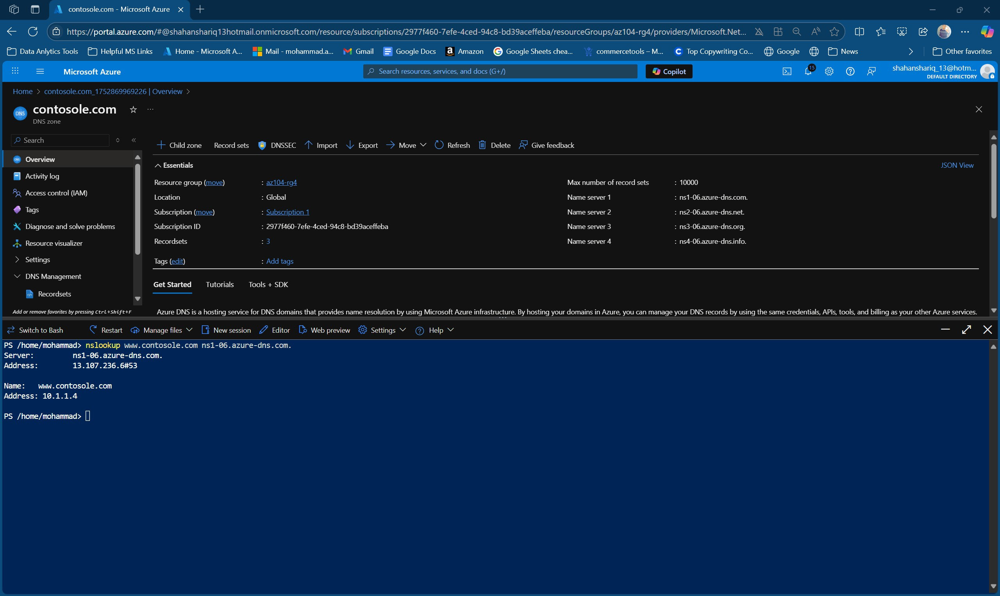

# AZ-104 Lab 04 – Implement Virtual Networking

## 📘 Overview

This repository contains a complete walkthrough of [AZ-104 Lab 04](https://github.com/MicrosoftLearning/AZ-104-MicrosoftAzureAdministrator/blob/master/Instructions/Labs/LAB_04-Implement_Virtual_Networking.md), which focuses on creating and managing virtual networks (VNets), subnets, NSGs, ASGs, and DNS zones within Azure. Every configuration step is documented with inline screenshots for learning and validation.

---

## 🧭 Task-by-Task Walkthrough

### Task 1: Create a Virtual Network and Subnets (Portal-Based)

1. **Initial state – no VNet present**  
   

2. **Created CoreServicesVnet – overview**  
   

3. **Subnet breakdown – SharedServicesSubnet and DatabaseSubnet**  
   

4. **Architecture view of the full setup**  
   

5. **Subnet configuration via portal**  
   

---

### Task 2: Export and Modify Template for VNet Deployment

1. **Exported template from CoreServicesVnet deployment**  
   

2. **Edited `template.json` and added ManufacturingVnet**  
   

3. **Updated parameters for address space and subnets**  
   

4. **ManufacturingVnet overview after deployment**  
   

---

### Task 3: Configure NSGs and ASGs

1. **Created Application Security Group: `asg-web`**  
   

2. **Created Network Security Group: `myNSGSecure` with rules**  
   

3. **Associated NSG with SharedServicesSubnet**  
   

4. **Configured inbound rule to allow traffic from ASG**  
   

5. **Confirmed inbound rule setup**  
   

6. **Created outbound rule to deny internet access**  
   

7. **Confirmed outbound rule**  
   

---

### Task 4: Configure Public and Private DNS Zones

1. **Created public DNS zone**  
   

2. **Added A record for web service**  
   

3. **DNS zone overview**  
   

4. **Verified name resolution with nslookup**  
   

5. **Created private DNS zone**  
   

6. **Linked private DNS zone to VNet**  
   

7. **Added A record to private DNS zone**  
   

---

## 📂 Repository Structure

| Folder        | Contents                                                  |
|---------------|-----------------------------------------------------------|
| `diagrams/`   | Network architecture visual                               |
| `dns-config/` | All public/private DNS zone steps                         |
| `notes/`      | Status confirmations and VNet overview                    |
| `security/`   | NSG/ASG creation, rules, and verification                 |
| `templates/`  | ARM template files and edits                              |

---

## 🎓 Learning Objectives

- Build and configure VNets via portal and templates
- Secure subnet traffic with NSGs and ASGs
- Implement and validate Azure public/private DNS zones
- Document full network lifecycle with embedded references

---

## 🔗 References

- [AZ-104 Lab 04 Instructions](https://github.com/MicrosoftLearning/AZ-104-MicrosoftAzureAdministrator/blob/master/Instructions/Labs/LAB_04-Implement_Virtual_Networking.md)
